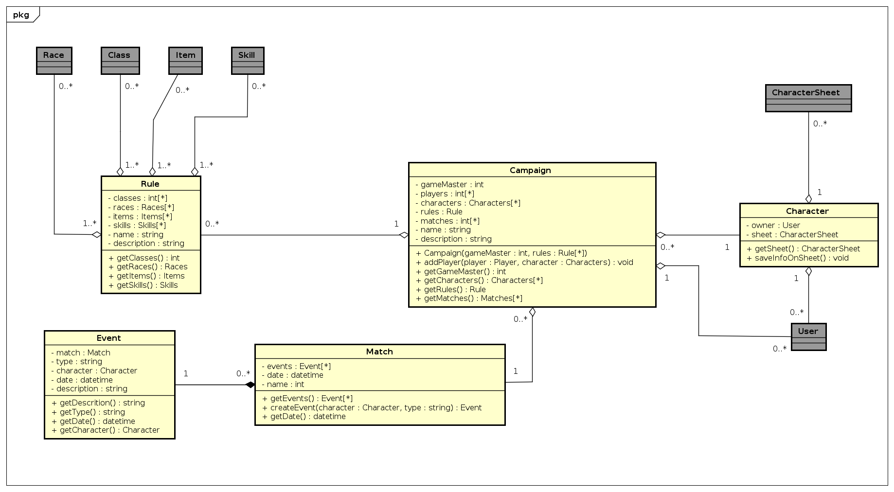

# Análise de viabilidade dos GoFs criacionais

## Factory method

### Estudo viabilidade

### Implementação

---

## Abstract factory

### Estudo viabilidade

### Implementação

---

## Singleton

### Estudo viabilidade

### Implementação

---

## Builder

### Estudo viabilidade

### Implementação

---

## Prototype

### Estudo viabilidade

### Implementação

---

<!-- ## Multiton

### Estudo viabilidade

### Implementação

---
 -->

## Object pool

### Estudo viabilidade
- A maior vantagem do object pool é o aumento de desempenho através do 'caching' de objetos.
- Interessante de se anialisar caso tenhamos problema de desempenho com a relação partida-jogador-personagem
- Interessante para casos de factory que precisem de tracking de objetos apos ser criados

### Implementação
- Pode valer a pena caso venha a dar problema de desempenho futuro aqui:

---

## Referências:
- Source Making. 2019. Design patterns. [ONLINE] Available at: https://sourcemaking.com/design_patterns/. [Accessed 24 October 2019].
